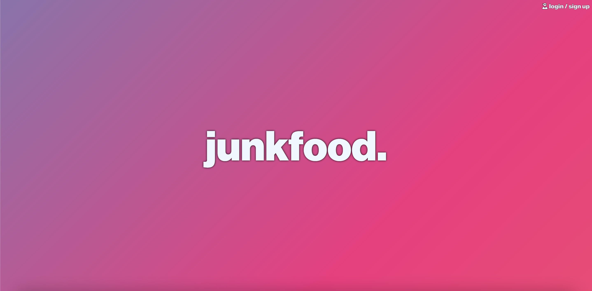
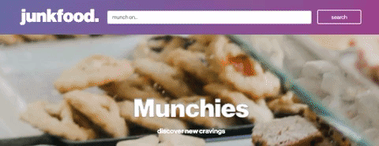

# Junkfood.

## **Objectives**
To create a dynamic front-end web application that incorporates an immersive UI experience. Utilizing 2 or more third-party APIs, the web application will provide and display still and animated content suitable for ages 13 and up. So whether you're a student making memes about their instructors, finding new ways to violate Facebook's terms and conditions, or Gary, theres something for everyone. This is Junkfood.

## Contributors

* [Devin Wulf](https://github.com/wulfsounds): 
Project Manager; Headers, HTML Scaffolding, 
wireframing, “snacc” page, hover menu and design.
    - HTML, CSS, Javascript, jQuery, moment.js, 
	Bootstrap manipulation & geocoding
    - OpenWeather API, Bootstrap v4.6
* [Inna Arabejo](https://github.com/inna-arabejo):
Splash and Login pages, “goodies” page, local storage
integration and design.
    - HTML, CSS, JavaScript, JQuery, Bootstrap manipulation
    - Bootstrap v4.6, local storage functionality

* [Victor Kennedy](https://github.com/Victorini1): “munchies” and “goodies” pages, DOM manipulation,
API integration and functionality.
    - HTML, CSS, JavaScript, jQuery, third-party APIs
    - Imgur & Giphy APIs, Bootstrap v4.6

Additional CSS*:

Dynamic Rainbow: Manuel Pinto (CodePen) 
Additional Local Storage: thbwd (CodePen)

## APIs Used

* Imgur API
* Giphy API
* OpenWeather API

## Links

* Typeface: [Neue Haas Grotesk]('https://fonts.adobe.com/designers/christian-schwartz')
* Local Storage Assist: [thbwd]('https://codepen.io/thbwd/pen/qBKGwx')
* Dynamic Rainbow Background: [Manual Pinto on CodePen]('https://codepen.io/P1N2O/pen/pyBNzX')

## Screenshots

View the deployed site here: [Junkfood.]('https://wulfsounds.github.io/g3p-junkfood/')

View the Repo Here: [GitHub]('https://github.com/wulfsounds/g3p-junkfood')

------------------------------------------------------
2022 SMU Coding Bootcamp, Group 3, Project 1